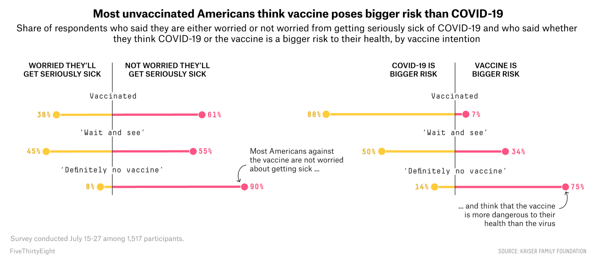
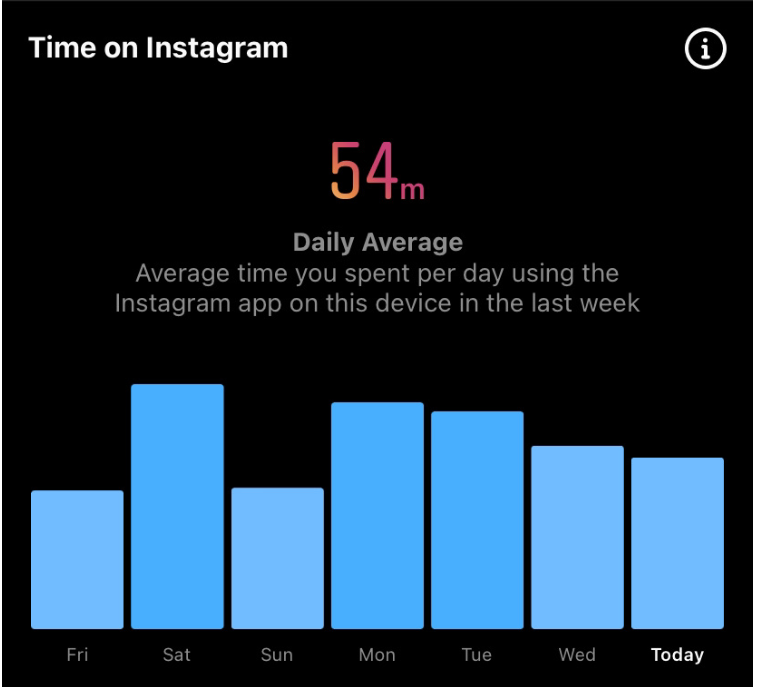
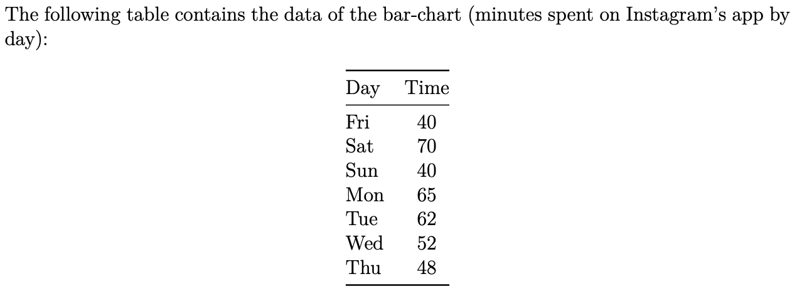
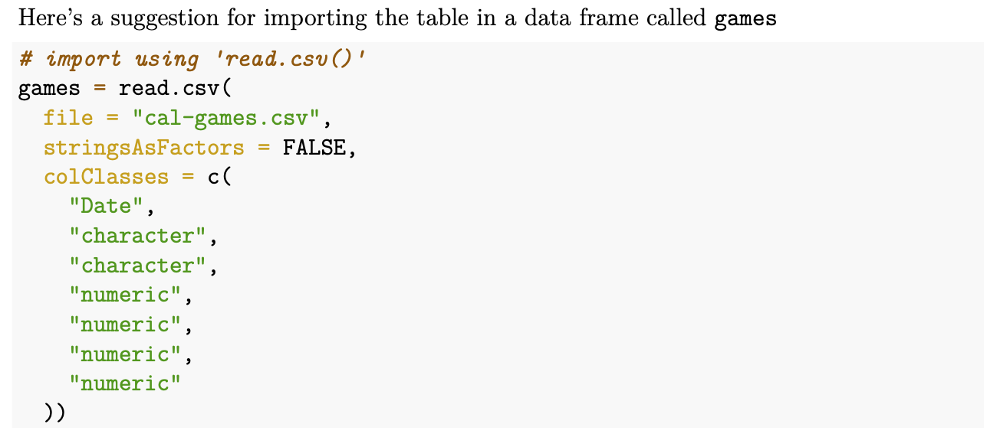

```{r}
library(tidyverse)
library(ggplot2)
library(lubridate)
library(ggdark)
library(reshape2)
```

### 1) Graphic from FiveThirtyEight   

a) Description/explanation of its context:    
  - What is the data-- e.g. individuals & variable(s)-- behind the graph    
  - Is there a time period associated to it?  
  - What is the type of graphic? (e.g. barchart, piechart, timeline, histogram, map, heatmap, etc)?   
  **The variables in the graph include: “WORRIED THEY’LL GET SERIOUSLY SICK”, “NOT WORRIED THEY’LL GET SERIOUSLY SICK”, “Vaccinated”, “Wait and see”, and “Definitely no vaccine”. The percentages on the graphic represent the percent of respondants who identify with any of two types of cateogries listed above. The graphic itself does not represent time as a variable. However, the data that the graphic visualizes are taken from a survey from July 15-27 (the year is not explicitly stated). The graphic is similar to a bar chart which shows the distribution of those who identify with each specific category.**

b) What color scheme (if any) is being used in the graphic?   
  **The color scheme appears to be closest to an analogous color scheme. There are two colors; One is a light red (almost pink) color and the other is a bolder and golden yellow.**

c) Taking into account the so-called "Data-Ink ratio", explain whether the graphic seems to be maximizing this ratio or not.   
  **The graphic does not appear to fully maximize the data-ink ratio. As show by the captions next to the percentage bars, it seems that the intention of the graphic is to add information to accompany the article. Without these descriptive captions, the visualization does appear to maximize the data-ink ratio as it is insightful, the color scheme is not distracting and there are the minimum amount of labels and units where appropriate.**

d) Describe the things you find interesting about the chosen graphic    
  - Is it the colors?   
  - Is it the visual appearance?    
  - Is it the way in which the data has been encoded graphically?   
  - Is there anything that catches your attention?    
  **For me, I found it the visual appearance of the graphic interesting. This type of graphic shown with multiple categories separated in a vertical format is not something I am used to seeing. As for the colors, I thought they were “warmer” colors and did not seem to show any bias when representing these opinions (for example, red/green or red/blue are often seen as opposites which implies that one is superior or inferior to the other). I also thought it was very interesting how there seems to be an axis (denoted by the veritcal grey line) that separates the two categories and is futher broken down into three more categories. This axis reminds me of the y axis where the percents the pecents of a certain category total to 100 percent.**
  
e) To include a screenshot of the graphic in your report, we suggest using the function `include_graphics()` from `"knitr"`. This function gives you more control on the appearance of the graphics in your html document. See figure below with a hypothetical example with the following code-chunk options:    
  - `out.width='85%'` allows you to control the width of the figure with respect to the html output. There’s also `out.height`    
  - `fig.align` allows you to control the figure alignment (left, right, etc)   
  - `fig.cap` lets you include captions   

```{r out.width='85%', echo=FALSE, fig.align='center'}

```

f) Also, include a link of the graphic's webpage, and the names of the authors/designers of the related article    

  link: [https://fivethirtyeight.com/features/unvaccinated-america-in-5-charts/](https://fivethirtyeight.com/features/unvaccinated-america-in-5-charts/)   

  article author: Elena Mejía   

  graphic source: Kaiser Family Foundation    


### 2) Instagram Graph    

#### 2.1) Graphic's Assessment    

```{r out.width='90%', echo=FALSE, fig.align='center'}

```

Provide an assessment of the bar-chart, describing the *good* and the *bad* about this data visualization.       

  **In this graphic, some good aspects I can see is that the color scheme is analogous and gets darker with increasing minutes of usage in the day. Another good aspect of the instagram visualization is that average usage of the week is clearly displayed in the center and in a different color, emphasizing that this is an important measure of center. Lastly, the graphic strategically does not have any gridlines or ticks which seems to be an attempt to maximize the data-ink ratio. Some bad aspects about this visualization is that there is no y-axis that shows the units or anything to measure the amount of minutes spent on Instagram per day. Additionally, the background color (assuming that this is not solely a dark mode feature) is black and does not maximize the data-ink ratio. Lastly, the ratio of the size of the subtitle to the size of the chart seems to be off and could potentially be distracting if we are to focus on this data visualization.**

#### 2.2) Replicate Instagram's Bar-chart   


Write code in R to replicate, as much as possible, the visual appearance of the Instagram barchart. 

```{r}
insta <- data.frame(
  Day = c("Fri", "Sat", "Sun", "Mon", "Tue", "Wed", "Today"),
  Time = c(40, 70, 40, 65, 62, 52, 48)
)
 
insta_graphic <- ggplot(insta, aes(x=fct_inorder(Day), y=Time, fill = Day)) +
  geom_col(stat="identity") +
  scale_fill_manual(values=c("#79b6ff",
                             "#58a9ff",
                             "#79b6ff",
                             "#58a9ff",
                             "#58a9ff",
                             "#79b6ff",
                             "#79b6ff"))

insta_graphic + 
  labs(title = "\nTime on Instagram",
       subtitle = "\n  54m \nDaily Average \nAverage time you spent per day using the \nInstagram app on this device in the last week \n  ") +
  dark_theme_classic() +
  theme(
    plot.title = element_text(hjust = 0, size = 12, face="bold"),
    plot.subtitle = element_text(hjust = 0.5, size = 14),
  ) +
  xlab("") +
  ylab("") +
  theme(axis.ticks.x= element_blank(), 
        axis.ticks.y= element_blank(), 
        axis.line.y = element_blank(), 
        axis.line.x = element_blank(), 
        axis.text.y = element_blank(),
        legend.position = "none",
        text=element_text(family="Helvetica"))
```


#### 2.3) Improved Alternative Instagram Visualization    
Write code to generate a graphic that improves the visualization of the original Instagram bar-chart.    
Also, provide a description/explanation of how your proposal improves the original chart.    

```{r}
insta_graphic + 
  labs(title = "Time on Instagram",
       subtitle = "\n  54m \nAverage time you spent per day using the \nInstagram app on this device in the last week \n  ") +
  theme_classic() +
  theme(
    plot.title = element_text(hjust = 0, size = 12, face="bold"),
    plot.subtitle = element_text(hjust = 0.5, size = 11),
  ) +
  xlab("") +
  ylab("") +
  theme(axis.ticks.x= element_blank(),
        axis.ticks.y= element_blank(),
        legend.position = "none",
        text=element_text(family="Helvetica"))
```

**In this updated version I have created of the graphic, I touch on the "bad" aspects I noted in the first part of the question. Firstly, I decided to change the background color to white as this minimizes the data-ink ratio. Second, I added axes in order to more explicitly see the average amount of minutes spent on Instagram per day so that the viewers is not left to guess. Finally, I changed the font size of the subtitle in order to keep a balance between the visualization and its description.**

### 3) Cal's Football Game-by-Game Statistics    
The data for this section is in `cal-games.csv.` (available in bCourses, in the same folder containing the `pdf` file).  



The data has to do with Cal's Football Team, and it contains game-by-game statistics from seasons 2010 to 2021. Statistics from 2020 were not included because of the Covid-19 pandemic effects on that season.   

The data set contains seven variables:    
  - `date`: date of the game    
  - `opponent`: name of the opponent team   
  - `home_away`: whether the game was at-home or away   
  - `cal_score`: Cal's score    
  - `opp_score`: Opponent's score   
  - `duration`: Duration of the game (in minutes)   
  - `attendance`: Game's attendance (number of people attending a game)   

Consider the following parts (a) to (c). Based on the provided data set, create a data visualization that allows you to address and answer each of these parts. Make sure to follow good practices/habits for creating data visualizations.    

```{r}
games = read.csv(
  file = "cal-games.csv",
  stringsAsFactors = FALSE,
  colClasses = c(
    "Date",
    "character",
    "character",
    "numeric",
    "numeric",
    "numeric",
    "numeric"
  )
)

head(games)
```

a) Does playing at home give Cal's football team an advantage over its opponents?

```{r}
cal_home <- games %>%
  filter(home_away == "home")

cal_away <- games %>%
  filter(home_away == "away")
```

```{r}
advantage1
```


```{r}
advantage <- data.frame(
  team = c("cal", "opp"),
  home = c(sum(cal_home$cal_score), sum(cal_away$cal_score)),
  away = c(sum(cal_home$opp_score), sum(cal_away$opp_score))
)

advantage1 <- melt(advantage, id.vars="team")

ggplot(advantage1, aes(x=team, y=value)) + 
  geom_bar(aes(fill=variable), position = position_dodge(), stat="identity") + 
  theme_minimal() +
  labs(title = "Scores of Cal Versus Opponent By Status",
       y = "Score") +
  guides(fill=guide_legend(title="Status"))
```

**According to the visualization, it appears that playing at home does not seem to give Cal an advantage. Shown in the grouped column chart, opponents score more than Cal when Cal is both at home and away.**

b) If we focus on those games in September, October and November, which month(s) tend to be a winning month for Cal? *Hint*: We recommend using the `month()` function from the package `"lubridate"` to extract the month of a date-time object.   

```{r}
ggplot(dat(), aes(x = Savings_Rate, y = value)) +
  geom_bar(aes(fill=variable), position = position_dodge(), stat = "identity")

```

```{r}
games_months <- games %>%
  mutate(month = month(date))

df <- games_months %>%
  group_by(month) %>%
  summarize(cal = sum(cal_score), opp = sum(opp_score))

df1 <- melt(df, id.vars="month")

ggplot(df1, aes(x=month, y=value)) + 
  geom_bar(aes(fill=variable), position = position_dodge(), stat="identity") + 
  theme_minimal() +
  labs(title = "Total Cal and Opponent Scores By Month",
       y = "Score") +
  guides(fill=guide_legend(title="Team"))
```

**The months September, October and November correspond to the 9th, 10th and 11th months of a year. In focusing on these months, it is shown through this visualization that Cal seems to have a winning month in September as the total score was highest for this month.**

c) Create a data visualization that uses the following variables/information:   
  - Cal's score   
  - Opponent's score    
  - Date (e.g. can be year, and/or month, or full date)   
  - `home_away` status    
  
*Hint*: We recommend using the year() function from the package `"lubridate"` to extract the year of a date-time object.

```{r}
cal_home_year <- cal_home %>%
  mutate(year = year(date)) %>%
  select(year, home_away, cal_score, opp_score) %>%
  group_by(year, home_away) %>%
  summarize(cal = sum(cal_score), opp = sum(opp_score))

cal_away_year <- cal_away %>%
  mutate(year = year(date)) %>%
  select(year, home_away, cal_score, opp_score) %>%
  group_by(year, home_away) %>%
  summarize(cal = sum(cal_score), opp = sum(opp_score))

head(cal_home_year)
```


```{r}
vis <- data.frame(
  Team = c("cal", "cal", "cal", "cal","cal","cal","cal","cal","cal","cal","cal","opp","opp","opp","opp","opp","opp","opp","opp","opp","opp","opp"),
  home = c(179, 106, 150, 86, 193, 21, 275, 91, 113, 67, 154, 96, 52, 180, 139, 262, 27, 267, 91, 150, 71, 115),
  away = c(131,262,126,190,266,472,170,242,167,209,131,175,262,217,412,215,372,244,250,115,214,152),
  year = c(2010, 2011, 2012, 2013, 2014, 2015, 2016, 2017, 2018, 2019, 2021)
)

vis1 <- melt(vis, id.vars=c("Team", "year"))
  
ggplot(vis1, aes(x=Team, y=value)) + 
  geom_bar(aes(fill=variable), position = position_dodge(), stat="identity") + 
  theme_minimal() +
  labs(title = "Cal and Opponent Scores By Year",
       y = "Score") +
  facet_wrap(year~.) +
  guides(fill=guide_legend(title="Status"))
```
